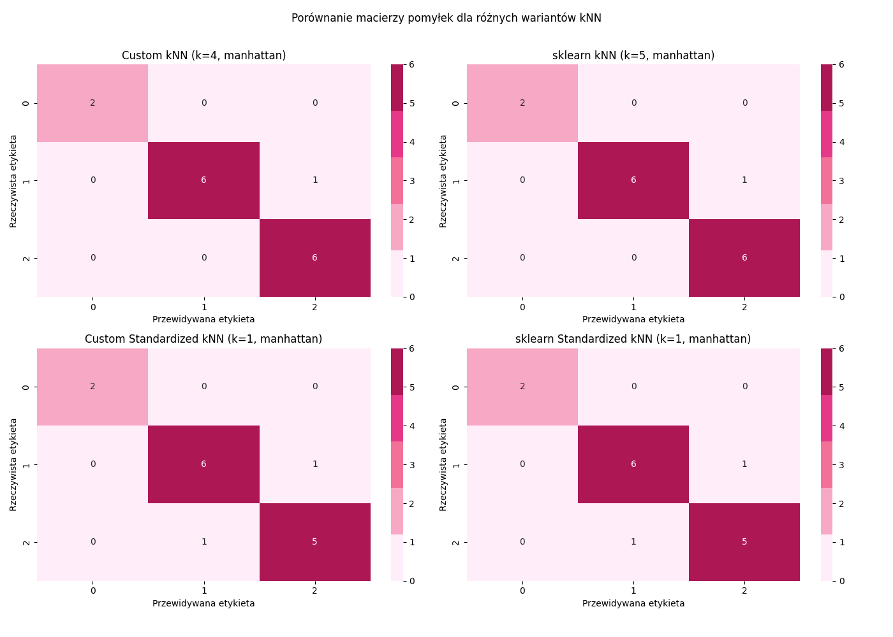

# Wpływ odległości Manhattan na klasyfikację k-NN

## Krótki opis problemu i podejścia
Celem projektu jest analiza wpływu metryki odległości (Manhattan i Euklidesowa) na skuteczność klasyfikatora k-NN. W tym celu wykorzystano dwa zbiory danych: własny zbór oraz zbór irysów. Implementacja obejmuje zarówno własną wersję algorytmu k-NN, jak i wersję wbudowaną z biblioteki scikit-learn.

Przykładowe wykorzystanie opracowanego rozwiązania:
```python
from helpers import process_data, knn_analysis
import pandas as pd
import numpy as np
from sklearn.preprocessing import LabelEncoder

if __name__ == "__main__":
    X_train, X_test, header = process_data("data.csv", "cleaned_data.csv", "train.csv", "test.csv")

    X_train = np.array(X_train)
    y_train = X_train[:, -1]
    X_train = X_train[:, :-1]

    X_test = np.array(X_test)
    y_test = X_test[:, -1]
    X_test = X_test[:, :-1]

    X_train = pd.DataFrame(X_train, columns=header[:-1])
    X_test = pd.DataFrame(X_test, columns=header[:-1])

    label_encoder = LabelEncoder()
    y_train_encoded = label_encoder.fit_transform(y_train)
    y_test_encoded = label_encoder.transform(y_test)

    knn_analysis(X_train, X_test, y_train_encoded, y_test_encoded, "manhattan", max_k=10)
    knn_analysis(X_train, X_test, y_train_encoded, y_test_encoded, "euclidean", max_k=10)
```

## Szczegółowy opis metodyki
### Algorytm k-NN
Algorytm k-NN klasyfikuje przykłady na podstawie ich podobieństwa do najbliższych sąsiadów.
Główne kroki algorytmu:
1. Obliczenie odległości między przykładem testowym a każdym przykładem treningowym.
2. Wybranie k najbliższych sąsiadów.
3. Określenie klasy przykładu testowego na podstawie głosowania większościowego.

### Metryki odległości
Odległość obliczano za pomocą:
## Metryka Euklidesowa:
$$
d_{\text{euclidean}}(x, y) = \sqrt{\sum_{i=1}^{n} (x_i - y_i)^2}
$$

## Metryka Manhattan:
$$
d_{\text{manhattan}}(x, y) = \sum_{i=1}^{n} |x_i - y_i|
$$

## Opis eksperymentów
Eksperymenty przeprowadzono na dwóch zbiorach danych. W każdym przypadku przetestowano różne wartości k oraz dwie metryki odległości. Analizowano dokładność klasyfikacji oraz różnice między implementacją własną a biblioteką scikit-learn.

### Przedstawienie zbioru danych
#### Własny Zbiór danych:

| Cecha       | Opis                                                         |
|-------------|--------------------------------------------------------------|
| **footfall** | Liczba cykli pracy maszyny                                  |
| **tempMode** | Tryb temperatury                                             |
| **AQ**       | Poziom jakości powietrza wokół maszyny                      |
| **USS**      | Prędkość wrzeciona                                           |
| **CS**       | Obciążenie silnika                                           |
| **VOC**      | Lotne związki organiczne w otoczeniu                         |
| **RP**       | Prędkość robocza                                             |
| **IP**       | Ciśnienie w układzie hydraulicznym                           |
| **Temperature** | Temperatura maszyny                                        |
| **fail**     | Awaria (0 – brak awarii, 1 – awaria)                        |

#### Zbiór danych irysów:

| Cecha              | Opis                                         |
|--------------------|----------------------------------------------|
| **sepal_length**   | Długość działki kielicha                     |
| **sepal_width**    | Szerokość działki kielicha                   |
| **petal_length**   | Długość płatka                               |
| **petal_width**    | Szerokość płatka                             |
| **species**        | Gatunek irysa (setosa, versicolor, virginica)|

### Prezentacja wyników
Eksperymenty wykazały, że dla większości przypadków standaryzacja poprawia wyniki klasyfikacji.
Wyniki dla własnego zbioru danych:

| Metryka   | k | Dokładność custom k-NN | Dokładność custom standaryzowany | Dokładność sklearn k-NN | Dokładność sklearn standaryzowany |
|-----------|---|------------------------|----------------------------------|-------------------------|----------------------------------|
| Manhattan | 1 | 0.7895                 | 0.8947                           | 0.8000                  | 0.8947                           |
| Manhattan | 3 | 0.8105                 | 0.9263                           | 0.8421                  | 0.9263                           |
| Euclidean | 1 | 0.7789                 | 0.8947                           | 0.8000                  | 0.8947                           |
| Euclidean | 3 | 0.7368                 | 0.8947                           | 0.7895                  | 0.9474                           |

#### Zbiór danych irysów:




#### Własny zbiór danych:


## Wnioski
- Wybór metryki wpływa na wyniki klasyfikacji.
- Standaryzacja cech poprawia skuteczność klasyfikatora.
- Implementacja k-NN w scikit-learn daje bardzo zbliżone wyniki do wersji customowej.
- Dla zbioru irysów metryka nie miała dużego wpływu, ale dla własnego zbioru można zaobserwować różne wyniki w zależności od metryki.


